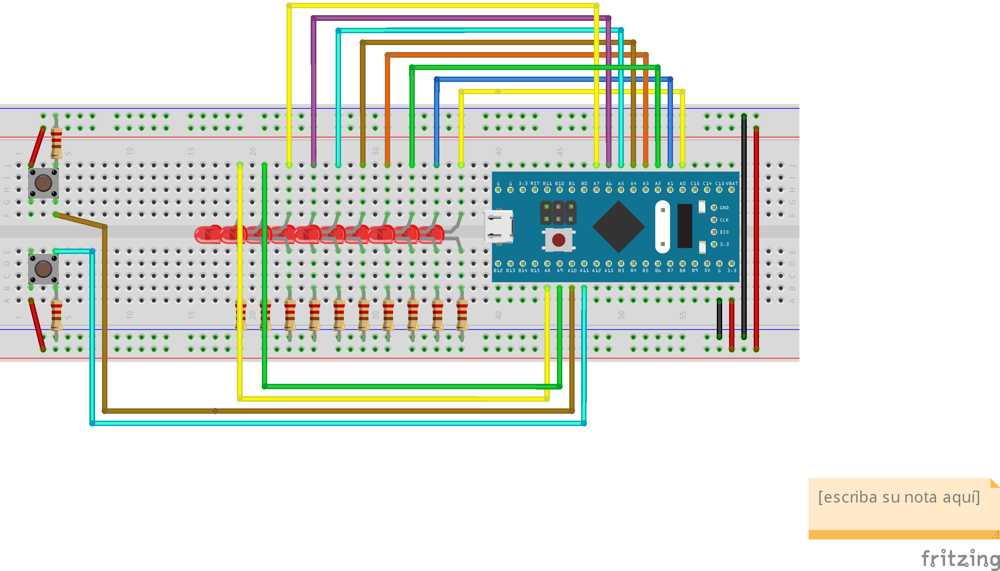

# Practica de Laboratorio 5

### **Funcionamiento del proyecto**

EL proyecto está conformado por 10 led que muestran el valor binario de una variable, los cuales se prenden por medio de dos push button que funcionan de la siguiente manera.

- SI se oprime el push button A se incrementa el valor.
- SI se oprime el push button B decrementa el valor.
- Si se oprimen ambos push button, se reinicia el valor.

### **Paquetes Necesarios:**

Para el funcionamiento de la blue pill se requiere de los siguientes softwares.

- El compilador cruzado que permite generar código máquina para microcontroladores.
- La instalación de los paquetes de Stlink mediante el entorno de MinGW.
- La instalación del STM32CubeProg para realizar la grabación del programa.

### **Alias necesarios**

- Aliar arm-gcc=arm-none-eab-gcc
- Aliar arm-as-arm-none-eabi-as
- Alias arm-objdumo=arm-none-eabi-objdump
- Alias arm-objcopy=arm-none-eabi-objcopy

### **Compilación del software**

En caso de que el código sea una clonación del repositorio de github, se debe desvincular con el comando make unlink

Limpiamos el proyecto de los archivos objetos de un anterior ensamble con el comando make clean.

Para realizar el ensamble se debe escribir el comando make, el cual creara os archivos objetos correspondientes y de iual manera el archivo prog.bin

Corremos el software STM32CubeProgrammer para grabar la blue pill, seleccionando la dirección de memoria 0x080000000 e iniciamos el grabado buscando el archivo prog.bin y descargándolo en la memoria del microcontrolador.

### **Main**

Es necesario configurar los 10 puertos de salida y los 2 de entrada. Una vez configurados y habilitados. Se realiza la configuracion de un ciclo que verifica el estado de los botones. Cabe mencionare que en caso de ser necesario que para la implementración de 10, se utilicen otros pines para los puertos de entrada se modifican de la siguiente manera.
.equ PIN10, 0x10
.equ PIN11, 0x11# configures pin 0 to 7 in GPIOA_CRL
        ldr     r0, =GPIOA_BASE @ moves base address of GPIOA registers
        ldr     r1, =0x33333333 @ PA[7:0] works as output, PA[6:5] as inputs 
        str     r1, [r0, GPIOx_CRL_OFFSET] @ M[GPIOA_CRL] gets 0x33333333
# configures pin 8 to 15 in GPIOA_CRH
        ldr     r1, =0x44448833
        str     r1, [r0, GPIOx_CRH_OFFSET] @ M[GPIOA_CRH] gets 0x44448833
.
.
.
buttonA = readbutton (PortA, pin10)
buttonB = readbutton (PortB, pin11)
if(buttonA && buton B)
counter = 0
else if (buttonA && !button B)
counter ++;
if(!buttonA && button B)
counter --
output (counter)

```nasm

```

```nasm

```

### Output

Funcion que se encarga de recibir como argumento un numero de 10 bits, este esta encargado mostrar el valor de counter a través de los puertos correspondientes a los leds.

Para que esto funcione es necesario utilizar una mascara con el valor 0x3FF, el cual corresponde 1023 para poder usar los 10 leds.

```nasm
output:
        ldr     r1, = GPIOA_BASE
        ldr     r2, = 0x000003FF
        and     r0, r2
        str     r0, [r1, GPIOx_ODR_OFFSET]
        bx	    lr
.size	output, .-output
```

### Read_button

Es un contador antirrebote. Dicho contador valida el estado de los botones. Si el boton no esta encendido (”0”) regresa el valor de falso y si al contrario esta encendido (”1”), realiza un ciclo para validar si se enciende más de cuatro veces seguidas.

### Digital read

Se encarga de leer el valor de los botones y hacer los dezplazamientos para optener el valor correspondiente al boton.

### Delay

Sirve para simular un retraso o activa una espera de dos ciclos for anidados.

### Diagrama del Circuito

